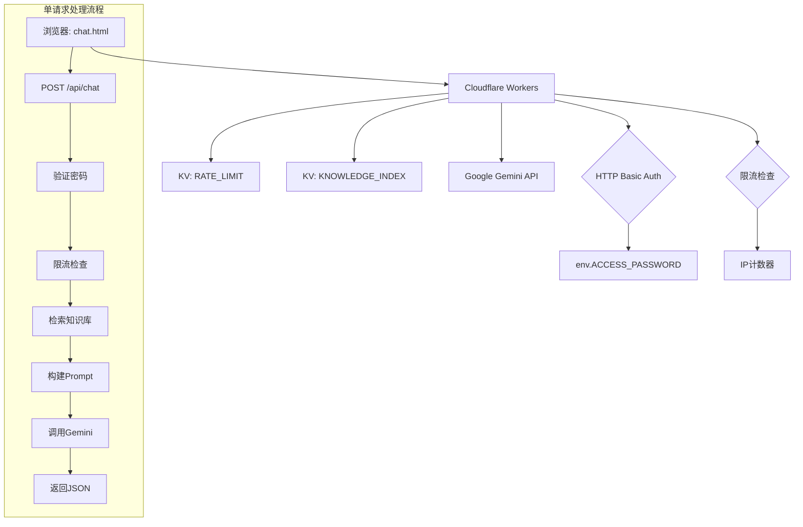

# Workers AI API 架构文档
**项目**：sc-chat-api（单细胞领域AI聊天API）
**版本**：v1.0
**最后更新**：2025-01-22

---

## 1. 系统架构

### 核心组件

```mermaid
graph TB
    Client[浏览器: chat.html] --> Workers[Cloudflare Workers];
    Workers --> KV_R[KV: RATE_LIMIT];
    Workers --> KV_K[KV: KNOWLEDGE_INDEX];
    Workers --> Gemini[Google Gemini API];
    
    Workers --> Auth{HTTP Basic Auth};
    Auth --> Password[env.ACCESS_PASSWORD];
    
    Workers --> RateLimit{限流检查};
    RateLimit --> Counter[IP计数器];
    
    subgraph 单请求处理流程
        Client --> Req1[POST /api/chat];
        Req1 --> AuthCheck[验证密码];
        AuthCheck --> RateCheck[限流检查];
        RateCheck --> Context[检索知识库];
        Context --> Prompt[构建Prompt];
        Prompt --> GeminiCall[调用Gemini];
        GeminiCall --> Response[返回JSON];
    end
```
